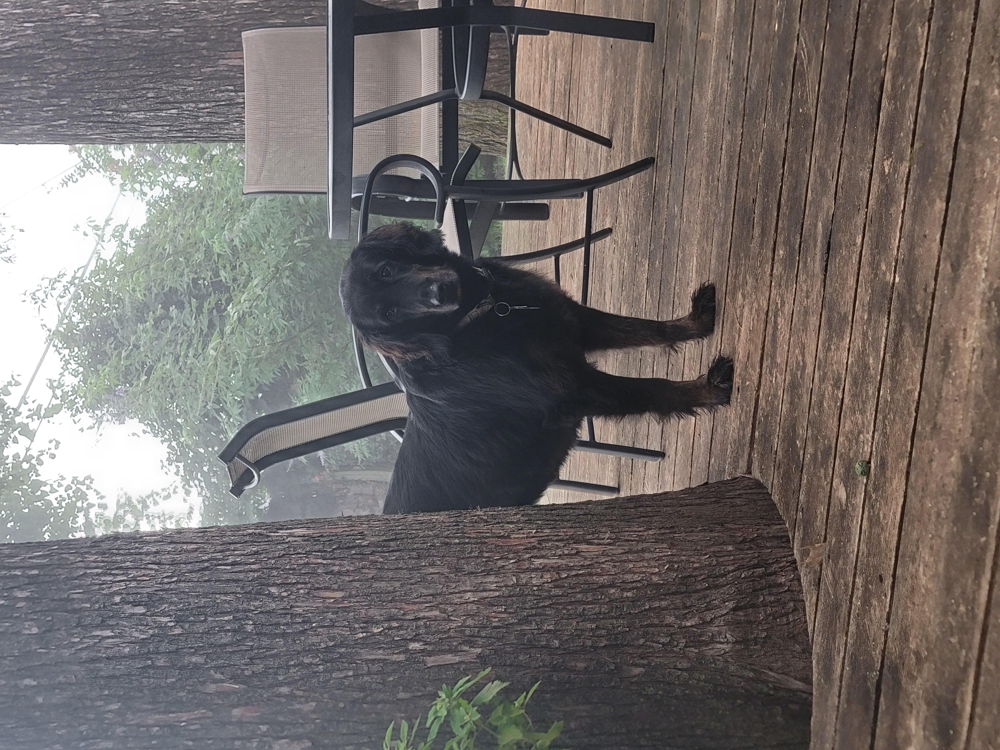

# Code Fellows Journey

----

## _My Code Fellows Reading Journal_

My name is Justin Fiddler and I want to thank you for checking out my Code Fellows Journey.

Check out my [profile on GitHub](https://github.com/Justin-Fiddler)

### 📫 👉 Justin.R.Fiddler@gmail.com
----

_(My dog and study buddy on a foggy morning)_

----

## Thoughts on the "Growth Mindset"

The growth mindset is a way to overcome self-doubt through persistence, but persistence must be fueled by motivation. Personally, my motivation comes from my competitive nature. I understand that if I am to become a professional in the tech world, I will be joining a large pool of experienced professionals. In this case, the only way to stand out is to continue learning. Every difficult task I complete on this learning journey will help me achieve my goals. So when I fail a task, it must be looked at as an opportunity to overcome what others could not. 

### How I keep a Growth mindset:

- Set a routine. For myself, a routine is habit forming. It establishes a block of time that is dedicated to the task. This helps me focus on the task I have prioritized. Once I have established that routine, I am much less likely to stop or quit before the task is finished. 
- Set small goals. I prefer that I complete small tasks and then take a break. The task could be reading for a dedicated amount of time or a task that should be completed in a half hour or less. 
- Take breaks. Taking breaks is very important to my success. From what I have read and experienced, a 15 minute break can help me bring a fresh set of eyes to whatever I may be working on. Sometimes, that break could be overnight. For me, my frustration usually coincides with my energy. If I am tired, I am more likely to misinterpret instructions and therefore set myself up for failure.
- Learn how to learn. In my past experience, learning a new skill can be frustrating. Mainly due to how I have changed without knowing it. As I have aged, how I learn efficiently has changed. So, having patience with myself while also exploring new ways of retaining information are vitally important to my success. I have to learn how to learn before I can learn. Also, writing "learn" in the same sentence three times somehow makes this less daunting. 

